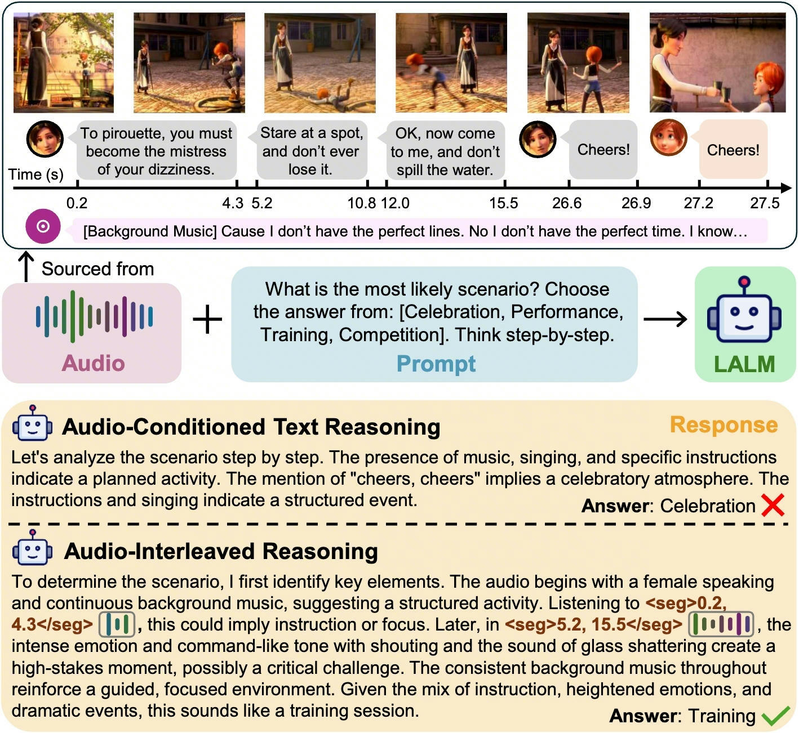

# Echo
Project page of "2026-ICLR Echo: Towards Advanced Audio Comprehension via Audio-Interleaved Reasoning"

Echo introduces an **audio-interleaved reasoning paradigm** that enables LALMs to proactively re-listen relevant audio segment during the reasoning process.

   
   

   <em>Figure 1: Example of audio-interleaved reasoning.</em>
   

Due to internal company policy, training datasets and model checkpoints cannot be released at this moment. However, to ensure transparency and reproducibility, in this repository we release complete training and inference code. Researchers can reproduce our framework using their own datasets following the formats described below.

## 🚀 Usage

### Stage 1 — SFT

Stage 1 trains a cold-start model that learns to perform audio-grounded reasoning and generate structured <seg> tag pairs required for later Think-with-Audio training.

1. Download the base model Qwen2.5-Omni from HuggingFace ([https://huggingface.co/Qwen/Qwen2.5-Omni-7B](https://huggingface.co/Qwen/Qwen2.5-Omni-7B)) and place it locally.
2. Prepare audio-grounded reasoning training data following the EAQA-SFT format described in the paper. Each sample should contain audio input, question-answer pairs, CoT reasoning, and grounded `<seg>` annotations. The dataset should be organized according to ms-swift data requirements.
3. Modify the training configuration in `script/stage1_ground_reason.sh`. Replace the `--dataset` argument with your dataset path and replace `--output_dir` with the directory where you want to save the trained model.
4. Start Stage 1 training by running: `bash training_script/stage1_ground_reason.sh`.
5. After training finishes, the cold-start model will be saved in the specified `output_dir`. This model must be capable of generating `<seg>` tag pairs, which is required for Stage 2 RL.

---

### Stage 2: - RL

Stage 2 performs reinforcement learning to enable multi-turn audio-interleaved reasoning ability.

1. Prepare Audio-QA training data corresponding to EAQA-RL. Unlike Stage 1, this dataset only requires audio and question-answer pairs only, without CoT annotations.
2. Convert the dataset into Parquet format following verl data requirements, including both training and validation splits.
3. Modify `script/stage2_multiturn_rl.sh`. Replace `data.train_files` and `data.val_files` with paths to your prepared Parquet datasets.
4. Replace the parameter `actor_rollout_ref.model.path` with the Stage 1 cold-start model directory obtained previously. This initialization is necessary because RL training assumes the model already has audio grounding capability.
5. Launch Stage 2 reinforcement learning by running: `bash training_script/stage2_multiturn_rl.sh`.
6. Training checkpoints will be automatically saved under: `Echo/verl/checkpoints/`.

---

### Stage 3: Inference and Evaluation

Stage 3 performs multi-turn inference and benchmark evaluation.

1. Prepare evaluation datasets including MMAR, MMAU-mini, and MMAU.
2. Open inference/inference_multiturn.py and modify dataset paths inside `DATASET_REGISTER`, setting the correct `audio_dir` and `qa_file` for each dataset.
3. Before inference, convert the verl checkpoint into FSDP format. Edit `script/merge.sh`, change the working directory (cd) to your verl environment, set `--local_dir` to the Stage 2 checkpoint path, and set `--target_dir` to a new directory different from `local_dir`. In line 8 of the script, also configure the Qwen2.5-Omni base model path together with the target directory (just copy `--target_dir`).
4. Run checkpoint merging: `bash script/merge.sh`.
5. Modify script/inference.sh by setting checkpoint to the merged `target_dir` and setting `n_gpu` to the number of available GPUs.
6. Run inference: `bash script/inference.sh`.
7. The script will sequentially perform inference on MMAR, MMAU-mini, and MMAU datasets, evenly distribute samples across GPUs, merge prediction results, and finally run the official evaluation scripts to compute metrics.

## 📌 Citation
If you find this work useful, please consider citing our paper:
<pre>
@inproceedings{
    wu2026echo,
    title={Echo: Towards Advanced Audio Comprehension via Audio-Interleaved Reasoning},
    author={Daiqing Wu and Xuan Zhang and Dongbao Yang and Jiashu Yao and Longfei Chen and Qingsong Liu and Sicheng Zhao and Can Ma and Yangyang Kang and Yu Zhou},
    booktitle={The Fourteenth International Conference on Learning Representations},
    year={2026},
    url={https://openreview.net/forum?id=xI6yOdOtga}
}